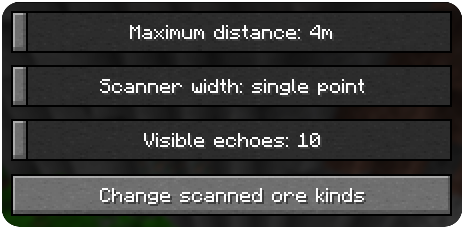
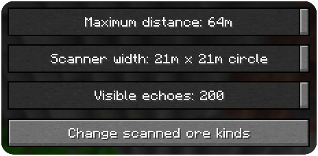
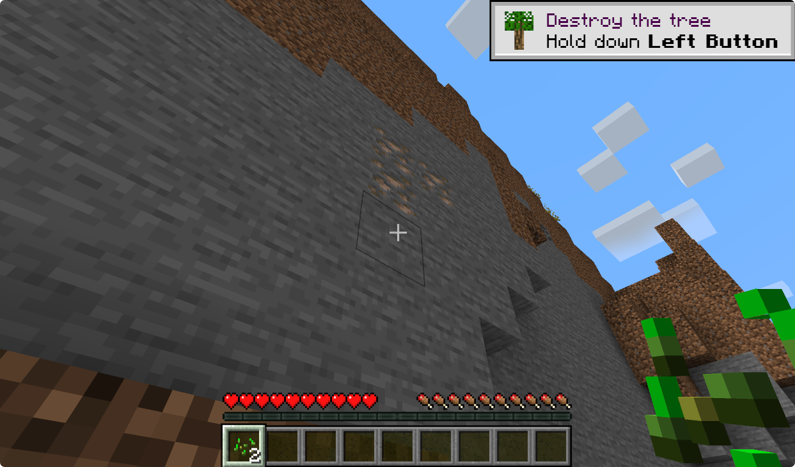
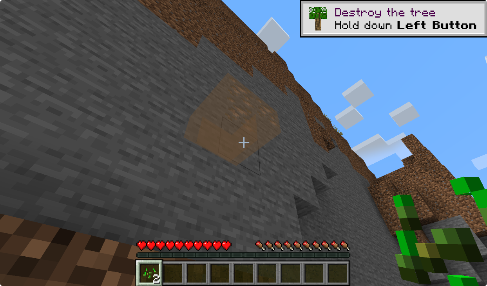
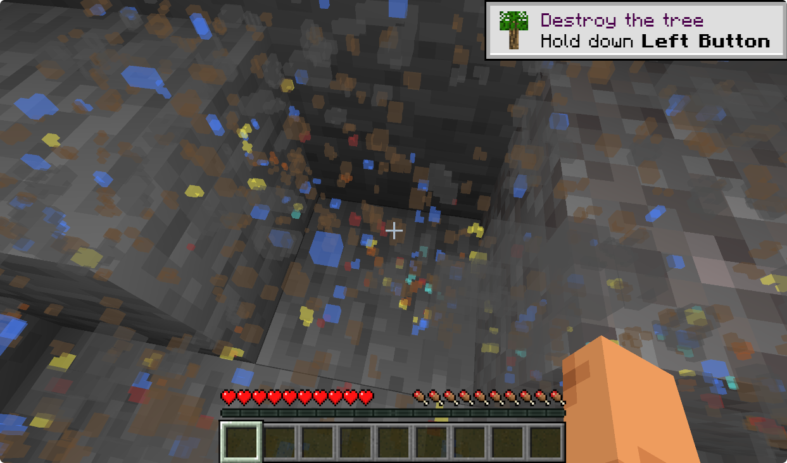
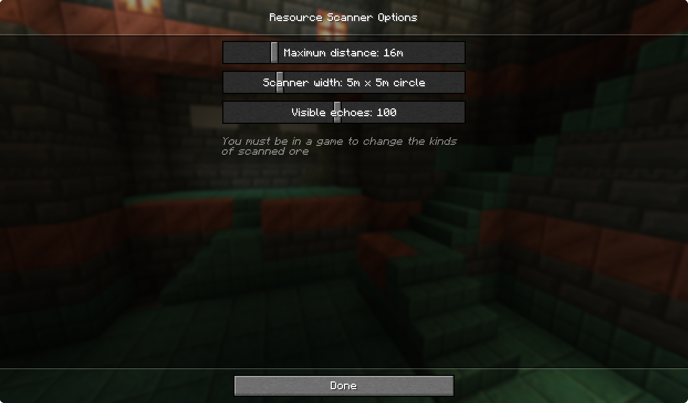
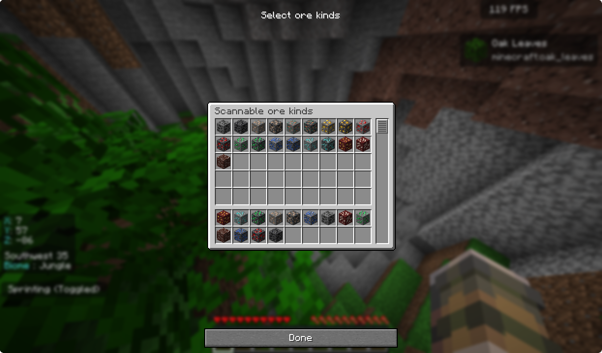

# Resource Scanner

<!-- modrinth_exclude.start -->
 <!-- modrinth_exclude.end -->

[![Mod loader: Fabric]][fabric]
 <!-- modrinth_exclude.start -->
 <!-- modrinth_exclude.end -->

Resource locator mod for Fabric.

## What is this mod?

It helps players to find resources more easily. At start, it only looks for coal, so the player can produce torches and fend-off mobs. At later stages, it can help locate resources near the player that are needed for advancing the session.

**WARNING** - mod is alpha quality, not tested with large number of mods, performance impact not known. Please, follow bug tracker to ask questions and report issues.

## Features

- scans resources in range of 32 blocks in the direction player is looking.
- can look for a specific resource or a list of resources
- presents the echoes of found resources
- supports configuration via JSON editing or Mod Menu plugin

## Usage

Pressing the scanner button will reveal the resouces, if any, in player's vicinity. It starts easy, with coal and deepslate coal ores, but later can be set up to look for anything you want (as long as you want to locate an ore). Just press `M` and enjoy.

The configuration is done through `config/resource-scanner.json` file. It will be created after first run. Alternatively, if you have a Mod Menu plugin installed, you can go into its screen from Minecraft menu and change the options there.

You can tweak the distance the scanner will try to reach, as well as width of the scaner cone and who long echoes are kept on screen. Finally, you can select the kinds of ore the scanner should look for.

 

## Screenshots

### Scanner in action

Running a scan will unveil chosen resources in player's vicinity. For instance, looking for iron might look something like this:

At the same time, putting a wider net may reveal much more iron, coal, dimonds and maybe some gold or redstone.

### Settings GUI

While it is possible to modify the scanner reach in the main menu you can, a runnig session is needed to to also select kinds of ore to scan.

This inventory can contain up to 18 ore kinds. It is possible to add more directly through the JSON file, but as shown on the screenshot, there no much more ores to choose from.

[fabric]: https://fabricmc.net
[Mod loader: Fabric]: https://img.shields.io/badge/modloader-Fabric-dbd0b4?style=flat-square&logo=
